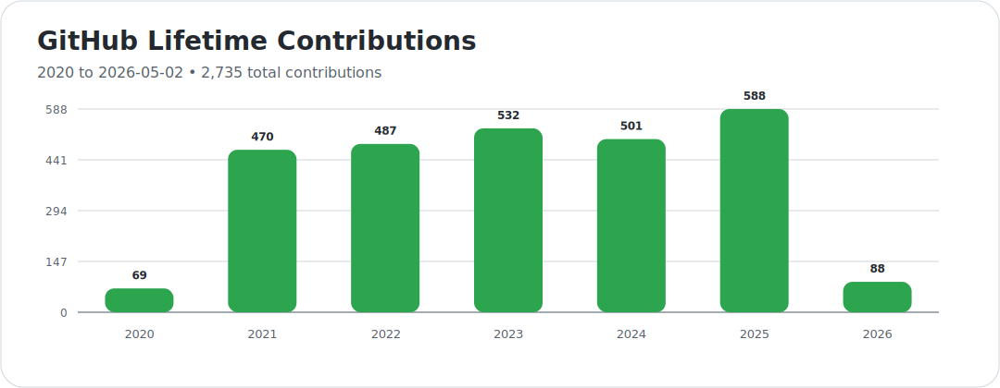

# Harshit Paunikar

  AI/ML Engineer • Full-Stack Builder • Production-Focused Problem Solver

  
  
  

 
## Profile Snapshot

> Applied AI engineer focused on building production-ready systems across LLMs, edge AI, computer vision, and real-time communication.

| Area | Summary |
| --- | --- |
| **Education** | IIT Madras, IIM Indore, IIIT Bangalore |
| **AI / ML Focus** | LLMs, RAG, prompt systems, vector search, edge AI, computer vision, OCR, and real-time voice workflows |
| **Experience** | 7 years in production engineering and 6+ years in data science across healthcare, logistics, banking, marketing, mobility, education, and internal platforms |

## Career Timeline

A concise view of the broader engineering and AI journey behind the GitHub-visible work. This is a career and learning timeline, not GitHub contribution history.

| Year / Range | Focus / Milestone | Related Skills |
| --- | --- | --- |
| `2015-2017` | Engineering foundation and academic build-up leading into advanced technical study, with early full-stack and programming depth forming the base for later AI work | `Python`, `C#`, `JavaScript`, `SQL`, `HTML`, `CSS`, `Backend Development`, `Frontend Development` |
| `2018-2019` | Data science and machine learning deepening, with stronger applied ML fundamentals and a sharper analytical foundation | `Machine Learning`, `Statistical Modeling`, `Feature Engineering`, `Scikit-learn`, `Pandas`, `NumPy`, `Model Evaluation` |
| `2020-2021` | Logistics-heavy build phase focused on computer vision, OCR, edge deployment, and operational systems for real-world field workflows | `Computer Vision`, `OCR`, `OpenCV`, `Tesseract OCR`, `Object Detection`, `Edge AI Deployment`, `SQLite`, `REST API Design` |
| `2022-2023` | Production engineering and platform expansion across logistics, banking, marketing, and internal platforms through backend systems, integrations, streaming, and delivery workflows | `FastAPI`, `.NET`, `Flask`, `NodeJS`, `Microservices Architecture`, `WebRTC`, `WebSockets`, `Docker`, `CI/CD Pipelines` |
| `2024-2025` | Shift into LLM systems, RAG, prompt engineering, on-prem AI, agentic workflows, and voice-first real-time AI systems | `LLMs`, `RAG Pipelines`, `LangChain`, `Prompt Engineering`, `Vector Search`, `Embeddings`, `LiveKit`, `Voice AI`, `On-Premises LLM Hosting` |
| `2026` | Current direction centered on practical AI systems, edge deployment, real-time intelligence, evaluation, and production-grade AI engineering | `AI Engineering`, `LLM Evaluation`, `Edge AI`, `ONNX`, `TFLite`, `Guardrails`, `Model Evaluation`, `Deployment on Clouds` |

## Professional Summary

I build AI systems that are meant to be deployed, operated, and trusted in real workflows, not left as demos. My work sits at the intersection of applied machine learning, backend engineering, edge deployment, and product-minded delivery.

**Core stack:** `Python` `C#` `JavaScript` `TypeScript` `FastAPI` `.NET` `Flask` `Node.js` `Docker`

**Specialized areas:** `LLMs` `RAG` `LangChain` `prompt engineering` `vector search` `ONNX` `TFLite` `WebRTC` `GStreamer` `LiveKit`

## GitHub Stats

### Overview

  

  
  

### Contribution Flow

  

<!--START_SECTION:lifetime-contributions-->
#### 2020 To Present

**Total contributions since 2020:** `2,736`

| Year | Contributions |
| --- | ---: |
| 2020 | 69 |
| 2021 | 470 |
| 2022 | 487 |
| 2023 | 532 |
| 2024 | 501 |
| 2025 | 588 |
| 2026 | 89 |

Updated: `2026-06-02 UTC`
<!--END_SECTION:lifetime-contributions-->

<!--START_SECTION:year-progress-->
### Year Progress

`████████████░░░░░░░░░░░░░░░░░░` **41.99%**

Updated: `03-Jun-2026 UTC`
<!--END_SECTION:year-progress-->

### Recent GitHub Activity

<!--START_SECTION:activity-->
<!--END_SECTION:activity-->

## Work Areas

| Area | What I Build |
| --- | --- |
| `Generative AI` | LLM assistants, grounded generation, tool-using agents, prompt workflows |
| `RAG Systems` | Retrieval pipelines, source-backed answering, document intelligence, citation-aware assistants |
| `Edge AI` | Runtime optimization, device-aware inference, ONNX Runtime, TensorRT, TensorFlow Lite |
| `Computer Vision` | OCR, image processing, object detection, browser and on-device CV workflows |
| `Real-Time Systems` | WebRTC, TURN/STUN, media streaming, LiveKit, audio and video pipelines |
| `Backend Engineering` | APIs, integrations, orchestration services, automation, production-facing backend systems |
| `Delivery` | Docker, deployment pipelines, CI/CD, monitoring, rollback-aware releases |

## Selected Projects

| Project | Focus |
| --- | --- |
| [Windows CPU-Only Offline AI Application](https://github.com/harshitpaunikar1/windows-offline-ai-app) | Local inference, OCR, structured capture, and resilient offline-first sync on standard Windows hardware |
| [Android Edge Vision for Logistics](https://github.com/harshitpaunikar1/android-edge-vision-logistics) | On-device inspection and detection workflows tuned for mid-range Android devices |
| [Medical Evidence Q&A Assistant](https://github.com/harshitpaunikar1/medical-evidence-qa-assistant) | Safety-aware medical RAG with evidence retrieval, citations, and refusal behavior |
| [Reliable Browser Video Calling](https://github.com/harshitpaunikar1/reliable-browser-video-calling) | One-to-one WebRTC calling with TURN fallback for restrictive real-world networks |
| [Real-Time Voice Agent](https://github.com/harshitpaunikar1/realtime-voice-agent) | LiveKit-based conversational voice pipeline connecting STT, LLM reasoning, and TTS |
| [Private Search Research Assistant](https://github.com/harshitpaunikar1/private-search-research-assistant) | Source-backed search workflow using aggregation, extraction, deduplication, and summaries |

## Current Direction

- Practical AI systems that can be deployed and maintained with clear operational behavior
- Voice-first and real-time AI experiences
- Edge deployment and low-latency inference
- Applied AI products grounded in actual workflow value

## Connect

- Portfolio: [harshitpaunikar1.github.io](https://harshitpaunikar1.github.io)
- GitHub: [github.com/harshitpaunikar1](https://github.com/harshitpaunikar1)
- LinkedIn: [linkedin.com/in/harsh2025](https://www.linkedin.com/in/harsh2025)
